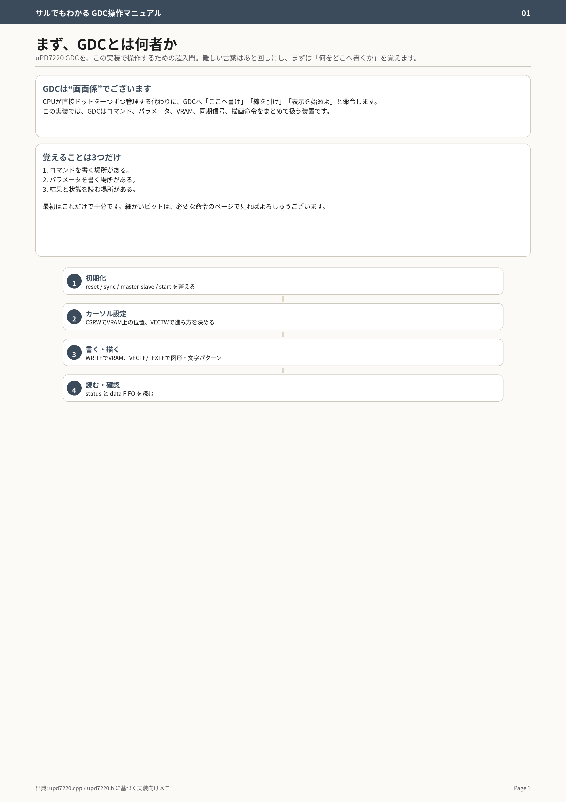

# サルでもわかる GDC 操作マニュアル

uPD7220A 系 GDC を LynxZ80Sim の実装で操作するための入門メモ。原本は同じディレクトリ内の `gdc_manual_A4_page_*.png` で、本文書は検索用の索引と実装時の早見表を兼ねる。

## 原本ページ

| Page | File | 主題 |
|---:|---|---|
| 1 | `gdc_manual_A4_page_01.png` | GDCとは何か、操作の全体像 |
| 2 | `gdc_manual_A4_page_02.png` | I/Oポートの見方、`addr & 3` による入口分岐 |
| 3 | `gdc_manual_A4_page_03.png` | 初期化の考え方 |
| 4 | `gdc_manual_A4_page_04.png` | `RESET` / `SYNC` / `MASTER` / `START` 系 |
| 5 | `gdc_manual_A4_page_05.png` | カーソル、VRAMアドレス、進行方向 |
| 6 | `gdc_manual_A4_page_06.png` | `CSRW` / `VECTW` 系 |
| 7 | `gdc_manual_A4_page_07.png` | VRAM書込 |
| 8 | `gdc_manual_A4_page_08.png` | 図形・ベクタ描画 |
| 9 | `gdc_manual_A4_page_09.png` | テキスト・パターン描画 |
| 10 | `gdc_manual_A4_page_10.png` | ステータスとFIFO確認 |
| 11 | `gdc_manual_A4_page_11.png` | よくある詰まりどころ |
| 12 | `gdc_manual_A4_page_12.png` | 実装確認チェックリスト |

## 基本モデル

GDC は CPU がドットを直接 1 点ずつ管理する代わりに、CPU から受けたコマンド、パラメータ、VRAM位置、同期条件、描画命令を処理する表示制御デバイスである。

この実装では、文字表示系とグラフィック表示系に uPD7220A 系 GDC が分かれている。

- 文字表示系: 文字GDC、テキストRAM、キャラクタジェネレータを扱う。
- グラフィック表示系: グラフィックGDC、グラフィックRAM制御、グラフィックRAM、ドットデータ出力を扱う。
- サブCPU系: GDCへの指示と表示処理の管理を担い、メインCPU系とはブリッジ経由で連携する。

## I/Oポートの見方

この実装では下位 2 ビット、つまり `addr & 3` で役割を分ける。

| `addr & 3` | 書くとき | 読むとき |
|---:|---|---|
| `0` | パラメータを書く | ステータスを読む |
| `1` | コマンドを書く | FIFOデータを読む |
| `2` | zoom値を直接書く | `0xff` |
| `3` | ライトペン要求扱い | `0xff` |

最も重要な作法は、コマンドを `+1` に書き、必要なパラメータを `+0` に続けて書くこと。

```cpp
write_io8(base + 1, CMD);     // コマンド
write_io8(base + 0, PARAM0);  // パラメータ
write_io8(base + 0, PARAM1);

status = read_io8(base + 0);  // ステータス
data   = read_io8(base + 1);  // FIFOデータ
```

注意点: 前コマンドが未完了のまま次コマンドを書くと、実装側で先に `process_cmd()` が走る。中途半端なコマンド列を放置しないこと。

## 操作の大きな流れ

1. 初期化
   - reset / sync / master-slave / start を整える。
2. カーソル設定
   - `CSRW` で VRAM 上の位置を指定する。
   - `VECTW` で描画方向や進み方を指定する。
3. 書く・描く
   - `WRITE` で VRAM にデータを書く。
   - `VECTE` / `TEXTE` で図形、文字、パターンを描く。
4. 読む・確認
   - status と data FIFO を読む。
   - busy / FIFO 状態を見て、次のコマンド投入タイミングを判断する。

## 初期化で確認するもの

- `RESET`: GDC内部状態を初期化する。
- `SYNC`: 画面同期、表示タイミング、水平/垂直パラメータを設定する。
- `MASTER`: master/slave 関係を設定する。
- `START`: 表示開始。

文字GDCとグラフィックGDCの双方が存在するため、どちらのGDCを初期化しているかをログで分離すると解析しやすい。

## VRAM位置と描画

GDCは現在位置、方向、描画モードを内部に持つ。CPU側からは次の順序で設定すると把握しやすい。

1. `CSRW` でカーソル位置を決める。
2. `VECTW` で方向、長さ、パターンなどを決める。
3. `WRITE`、`VECTE`、`TEXTE` などで実際の描画を行う。

LynxZ80Sim の表示処理では、グラフィックRAMはプレーン単位で扱われ、最終的に RGB と同期信号へ変換される。

## デバッグ観点

- コマンドポートとパラメータポートを取り違えていないか。
- コマンド投入後、必要パラメータ数をすべて書いているか。
- busy状態を無視して次コマンドを投入していないか。
- 文字GDCとグラフィックGDCのI/O範囲を取り違えていないか。
- VRAMアドレスが画面範囲、または実装上のVRAM範囲を越えていないか。
- 同期パラメータが未設定のまま描画だけ行っていないか。

## 実装参照

- `src/vm/Lynxz80/LynxZ80.cpp`
  - サブCPU側I/Oから文字GDC/グラフィックGDCへ振り分ける。
- `src/vm/Lynxz80/display.cpp`
  - GDC状態とVRAM内容から画面バッファを生成する。
- `src/vm/Lynxz80/display.h`
  - 表示系の接続、テキストRAM、グラフィックRAM、GDC参照を保持する。

## Markdown内画像参照



以降のページは同じ命名規則で `gdc_manual_A4_page_02.png` から `gdc_manual_A4_page_12.png` までを参照する。

